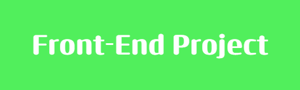

# Movie-Database-Web-Application
start-date: 8/23/2023

  
  
  
  
  

  
  
  
  
  

Project ScreenShots

Project Overview - the entirety of this project can be broken down into four major facts
    THE PAGES (3)
        - home page
        - movie detail page
        - movie list page

    THE USER INTERFACES
        - Header UI
        - Sidebar UI
        - Movie Banner UI
        - Movie Slide UI
        - Movie Detail UI
        - Movie List UI
        - Search Modal UI

    THE API ENDPOINTS
        - TMDB Movie List Request
        - TMDB Popular Movies Request
        - TMDB Upcoming Movies Request
        - TMDB Weekly Trending Movies Request
        - TMDB Movie Detail Request
        - TMDB Movie Recommendation Request
        - TMDB Movie Category Request

    THE FUNCTIONALITIES
        - Searching Functionality
        - Load More Functionality
        - Pages Communication
        - Dynamic Rendering

Project User Interface
    Header UI
    
    [!Header UI](./ass)